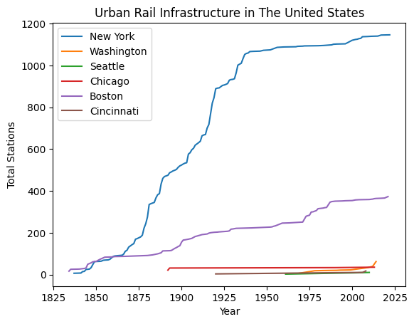
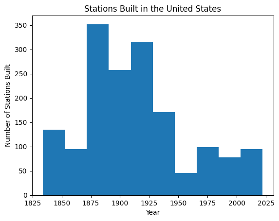
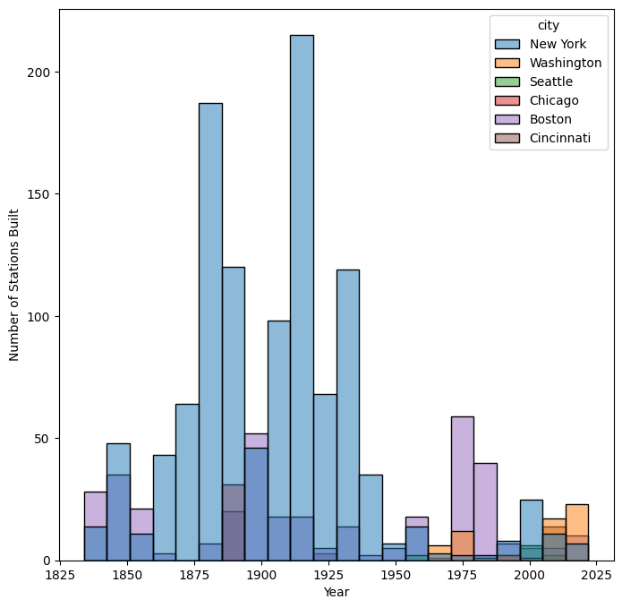

# CityLines Exploratory Data Analysis

## The dataset contains information about urban transit systems including:

* Cities - Geospatial and historical beginning of urban transit system
* Stations - Historical data on build start and opening
* Lines - Geospatial 
* Stations - Correlation with Lines and historical data

Our initial analysis showed that the data could be used to track the expansion over time. Our Research Question: How does the expansion of Urban Rail Infrastucture system infrastructure correspond with changes in U.S. metropolitan areas over time?

Starting Point: 

First, data cleaning, then merging multiple dataset into one: 

* line_drops - drop columns 'url_name', 'color', 'transport_mode_id'
* cities_usa - drop column 'url_name' and filter to extract only ['country'] == "United States"] 

* Merge line_drop & cities_usa into cities_lines by joining columns, ['city_id'] [right_on='id'] 
* Rename columns ('name':'city) and (city_id': 'id')
* Drop Non-value in the subset='city'

*Merge stations and cities_usa = cities_stations with the columns (left_on='city_id', right_on='id')
* Renaming cities_stations columns (name_y':'city') , (city_id':'id'})
* dropna(subset='city')
* cities_stations: filtering the cities_stations[cities_stations['buildstart']> 0]

# Data Visulization 1 - Line Graph New York 

- Showcasing total stations in New York overtime using cumsum

# Data Visulization  2- Line Graph for Urban Rail Infrastructue in The US

- Showcasing different cities building the stations overtime

# Data Visualization 3 - Histogram "Stations Built in the United States overtime"

- Showcasing overall US stations built overtime

# Data Visualization 4 - Stacked Histogram "Staionts Built in the US cities"

- Showcasing comparsion between the different cities building stations in US overtime

# Conclusion/Findings -  
Stations being built skyrocked between 1850 - 1930. 
Became less in demands until 1975

Future Analysis: Incorporate US Census data to see if there's a correlation between US population and urban rail system.